## 1. Creating Watson Discovery instance

Perform this step if you do not already have a Watson Discovery resource available.

First, go to https://cloud.ibm.com/resources where you need to click the "Create resource" button

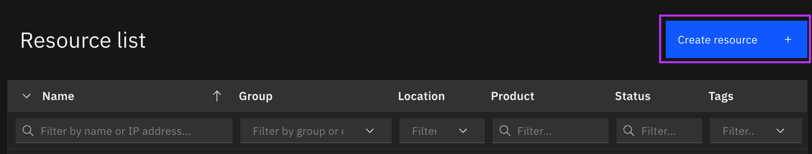

Then search in the resource directory for Watson Discovery (1.) and then select it (2.)

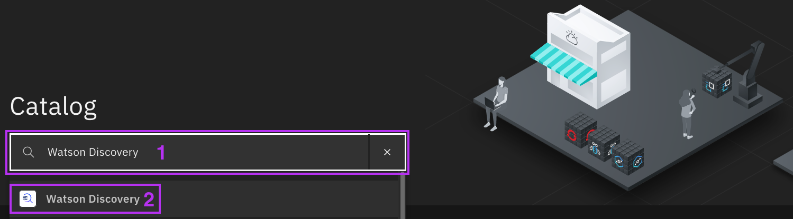

Select the instance location that suits you (Dallas by default) (1.). Then pricing the plan that matches your expectations. (2.) Accept the license terms. (3.) And finally, click the "Create" button. (4.)

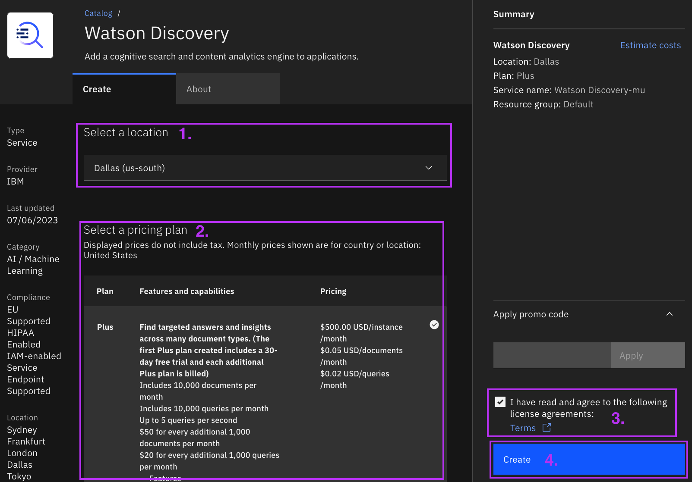

## 2. Accessing Watson Discovery instance

Once you have a Watson Discovery instance, it will be available at https://cloud.ibm.com/resources under the AI / Machine Learning category. Click on it to proceed further.

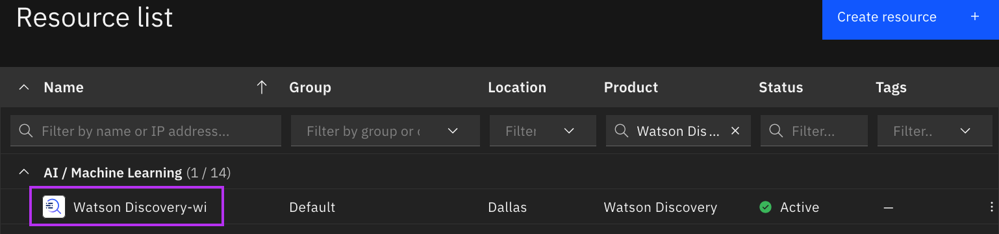

Once in the instance, click on the "Launch Watson Discovery" button to start working with it. (1.)

NOTE: On the current sub-page, you may notice a Credentials section where you can find the API key and URL that you will need in the next steps for configuration. (2.)

## 3. Creating new project

Now, in order to start working on your documents, you need to create a new project by clicking on the "New project" button

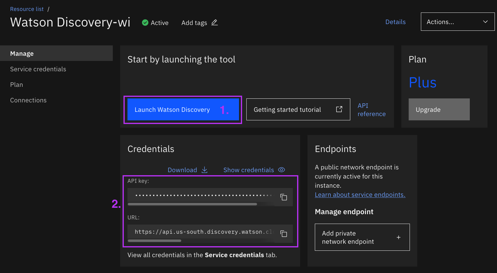

Give a name to your project (1.), select Project type "Document Retrieval" (2.) and proceed by clicking the "Next" button. (3.)

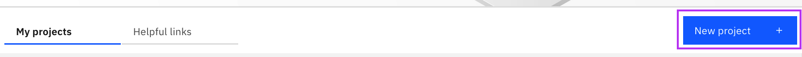

Choose where you want to upload your data from - in this case I'm using a local file, so I choose "Upload data" (1.), and then click "Next."(2.)

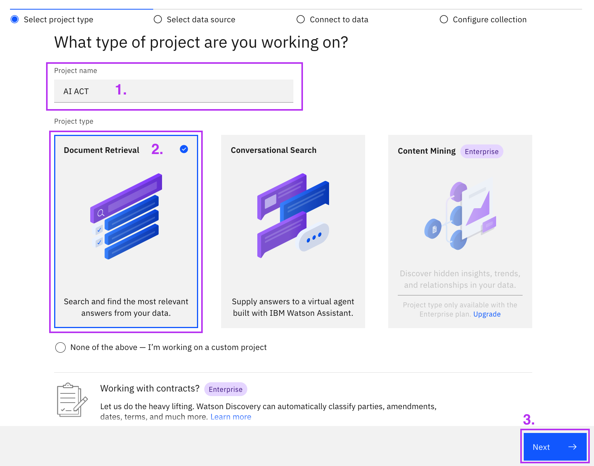

I choose the name of the collection and the language of the collection - in my example I use Polish. (1.) We click "Next". (2.)

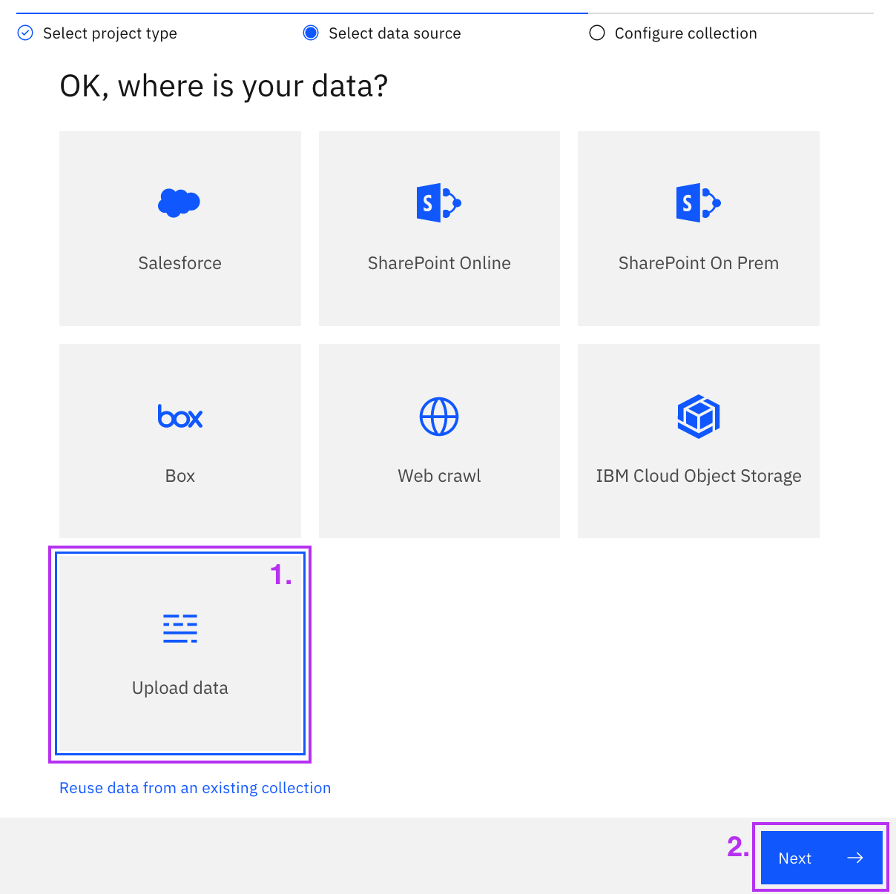

I select the appropriate file (1.) and then click "Finish". (2.)

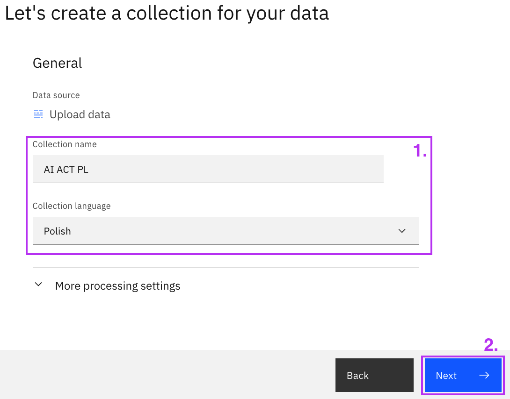

We are automatically transferred to the created project. It is also available within the list of projects available by clicking on "My Projects" in the menu at the top. 

## 4. Working in the project

While in the corresponding project. In the menu on the left, we go to the "Manage Collections" section.

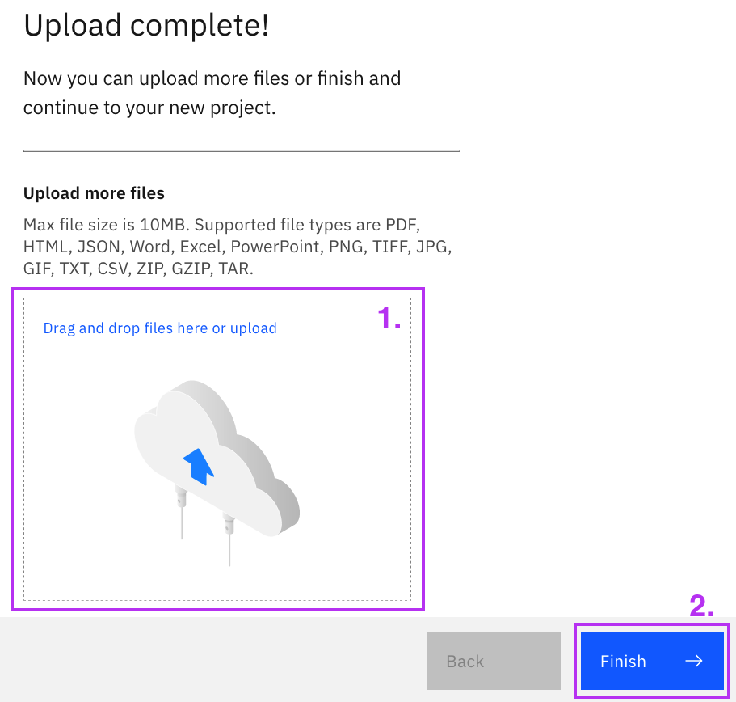

Then we enter our newly created collection. 

Note that Watson Discovery takes a while to process the documents loaded into it, so "Documents available" may be 0.

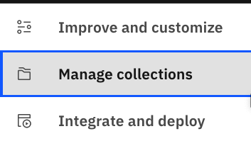

After entering the collections, we see how many documents are still processing and how many are available. When all the documents have processed, click on the "Identify fields" section.

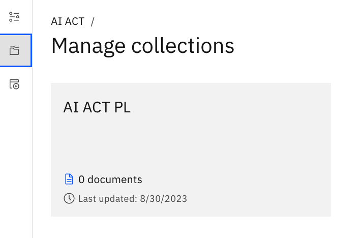

Since we want to show Watson Discovery how we want the document to be searched, we select "User-trained models" (1.) and click on "Apply changes and process". (2.) 

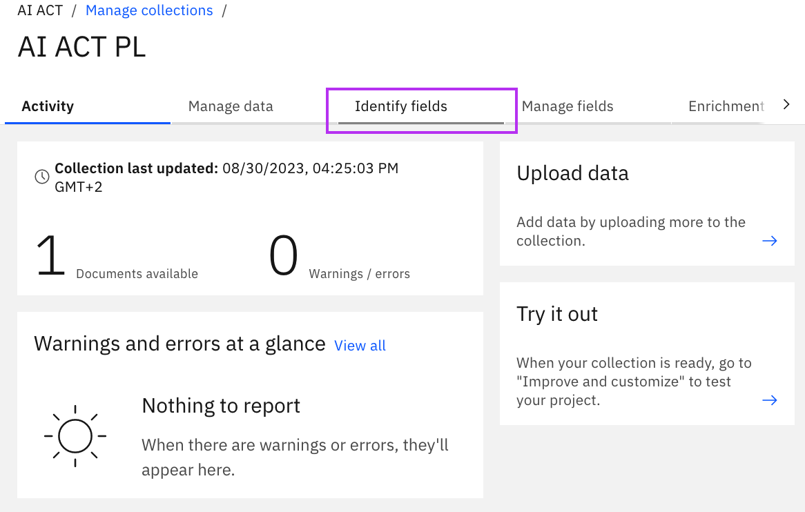

Now we're going to use the "Smart Document Understanding" mechanism to show the tool what each document element is in the text. In the case of my file, I have AI Act corrections that I would like to exclusively leave in my search. To do this, I select the appropriate blocks from the menu on the right and select the part of the text that corresponds to the specific blocks (1.). If the document has a fixed structure, then after a couple of pages that we accept with the "Submit Page" button (2.) the tool should automatically suggest the structure to us, and when we notice that it is correct, we can click "Apply changes and reprocess" (3.), and then go to the "Manage Fields" section (4.).

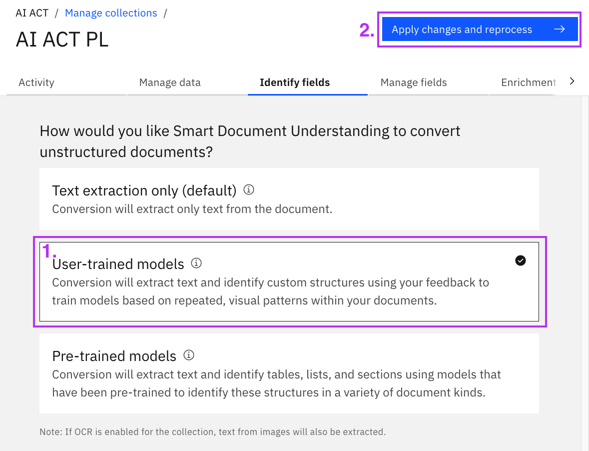

Now we want to set it to search only the fields that actually contain the content we are interested in. To do this, I excluded from the index all fields except the "New" field, where in the previous step I marked the document content containing the AI Act amendments of interest. (1.) Next, I would like the document to be divided into individual amendments, so that the returned search result from Watson Discovery includes only one amendment in each passage. (2.) After everything is done, I click "Apply changes and reprocess. (3.) 

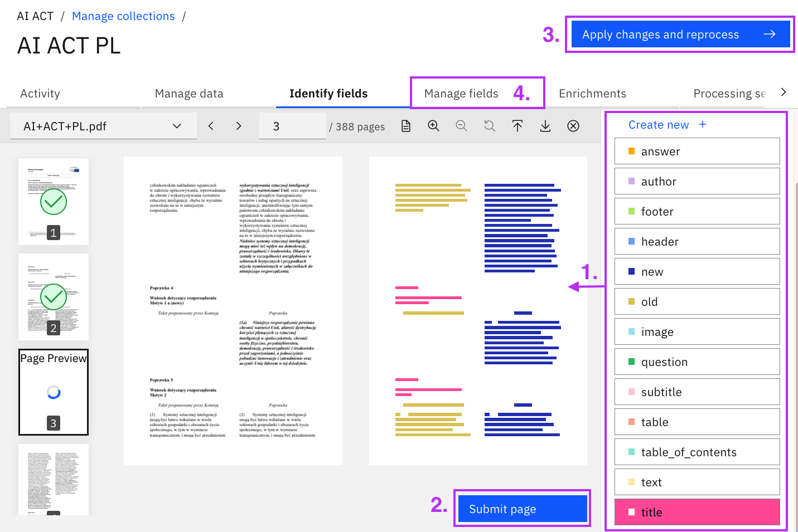

Now that the document has processed, you can see in the "Activity" section (1.) that the number of available documents has increased significantly. In the "Manage data" section (2.), you can preview what the individual documents created from parts of the original document look like. Now you are ready to search the document and test the capabilities of the Watson Discovery search engine!

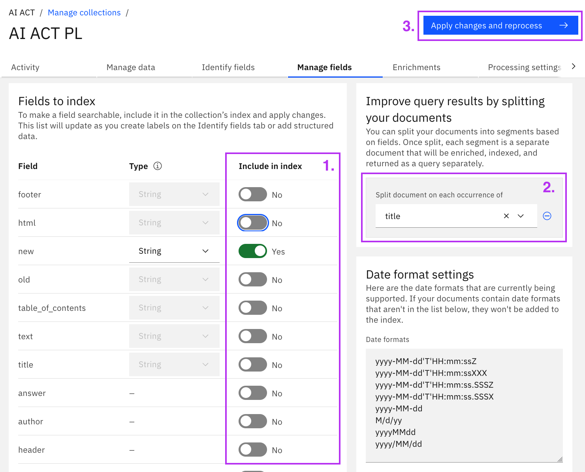

To test your Watson Discovery search, go to "Improve and customize" (1.) in the left-hand menu and enter your query in the Search bar. (2.)

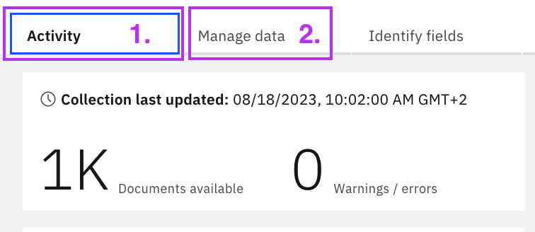

## 5. Integrate Watson Discovery with other tools

To integrate Watson Discovery with other tools, you will need 3 items for this:

- API key - which was available in step 2. Accessing Watson Discovery instance, where in being in Watson Discovery instance, in Credentials section it was possible to copy it
- URL - analogous to the API key, it is also available in the Credentials section of the Watson Discovery instance
- Project ID - you get to it from the Watson Discovery project, where in the left-hand menu you select the "Integrate and deploy" section (1.), then go to "API Information" (2.) and download the "Project ID" (3.)

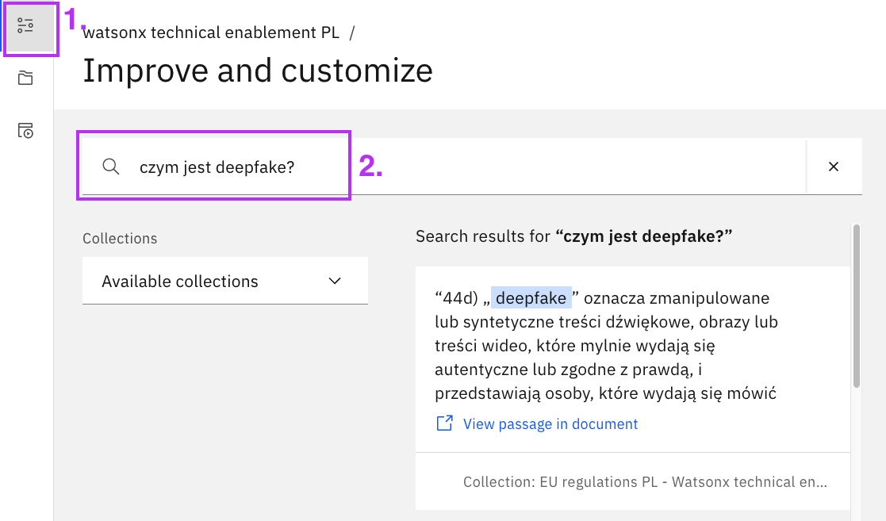

With the above 3 codes, we are able to connect using the API to our project from Watson Discovery and search it from the console.
