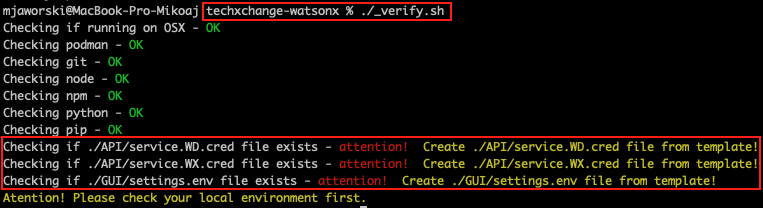
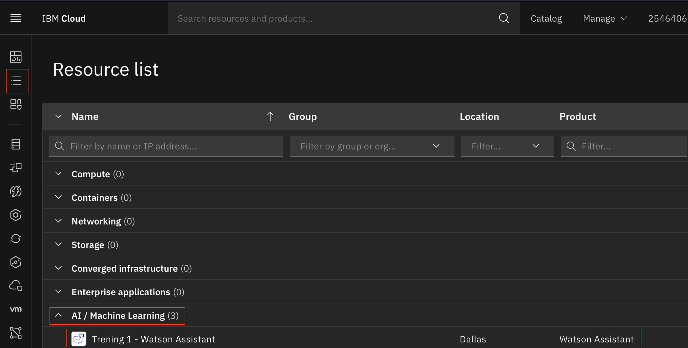

# Preparation of credential files for DEMO watsonx

## 1. Befor you begin

Before preparing the credential files, we need to check the current status of the requirements for our demo.
To check if we meet the requirements to run our demo, after cloning the demo repository (techxchange-watsonx), run the '''_veryfy.sh''' script from the main repository folder (./"your folder path"/techxchange-watsonx).

Assuming you have installed the appropriate tools, you should receive the following message:

As you can see there are three files missing. The purpose of this document is to show how to prepare these files.

## 1. Preparing service.WA.cred file

### 1.1 Copy service.WA.cred file
- Go to API/ folder
- Create a copy of ''' service.WA.cred-template ''' by runing:
''' cp service.WA.cred-template service.WA.cred '''
- Open the created file by running:
''' vim service.WA.cred '''

### 1.2 Fill "apikey" row

## 2. Preparing service.WX.cred file

## 3. Preparing settings.env file

