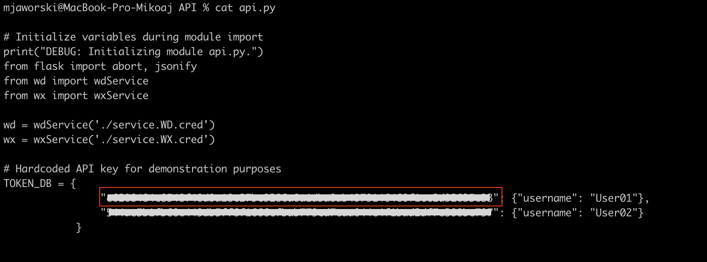

# Preparation of credential files for DEMO watsonx

## 1. Befor you begin

Before preparing the credential files, we need to check the current status of the requirements for our demo.
To check if we meet the requirements to run our demo, after cloning the demo repository (techxchange-watsonx), run the ```_veryfy.sh``` script from the main repository folder (./%your folder path%/techxchange-watsonx).

Assuming you have installed the appropriate tools, you should receive the following message:


As you can see there are three files missing. The purpose of this document is to show how to prepare these files.

## 1. Preparing service.WD.cred file

### 1.1 Copy service.WD.cred file

- Go to techxchange-watsonx/API folder.
- Create a copy of ```service.WD.cred-template``` by runing:
```cp service.WD.cred-template service.WD.cred```
- Open the created file by running:
```vim service.WD.cred```


- Keep the terminal open on this file.

### 1.2 Fill "apikey", "iam_apikey_description", "iam_apikey_name", "iam_role_crn", "iam_serviceid_crn" and "url" rows

- Go to [IBM Cloud](https://cloud.ibm.com/login)
- Login with your IBMid.


- Change workspace to DEMO shared workspace. In my case "2546406".


- Go to "Resources".
- Click on "AI / Machine Learning".
- Click on "Watson Discovery" service.


- In Watson Discovery service page go to "Service credentials".
- Click "New Credential +".


- Fill out the form with following information:
    Name:  "initials"_WD_"DayMonth"
    Role:  Writer
- Click "Add".


- Expand created credential.
- Copy apikey (without " ") - Mark the text --> right-click --> copy
- Go back to the terminal and click ```i``` to enable INSERT mode (now you can type).
- Go to  second " in the "apikey" line (using keyboard arrows).


- Paste the "apikey" - right-click --> Paste
- Repeat the copy and paste operation for "iam_apikey_description", "iam_apikey_name", "iam_role_crn", "iam_serviceid_crn" and "url"


- Keep the terminal open on this file.

### 1.3 Fill "projectid" row

- In Watson Discovery service page go to "Manage".
- Click "Launch Watson Discovery".


- Find "watsonx technical enablement" project and click on it.


- Go to the hamburger menu and click "Integrate and deploy".


- Go to "API Information" tab. See the Project ID.
- Repeat the copy and paste operation for "projectid" in terminal.
- You should have all rows filled. To save the file: click "esc" (to exit INSERT mode) --> click ":" --> enter ```wq``` --> click "enter"
- Done! Good job!

## 2. Preparing service.WX.cred file

### 2.1 Copy service.WX.cred file

- Go to the terminal. You should be in techxchange-watsonx/API folder.
- Create a copy of ```service.WX.cred-template``` by runing:
```cp service.WX.cred-template service.WX.cred```
- Open the created file by running:
```vim service.WX.cred```


- Keep the terminal open on this file.

### 2.2 Fill "bam-apikey" row

- Go to [BAM watsonx environment](https://bam.res.ibm.com/).
- Login with your IBMid.
- Copy "bam-apikey".


- Go back to the terminal and click ```i``` to enable INSERT mode (now you can type).
- Go to  second " in the "bam-apikey" line (using keyboard arrows).
- Paste the "bam-apikey" - right-click --> Paste


- Keep the terminal open on this file.

### 2.3 Fill "apikey" row

- Go to [IBM Cloud](https://cloud.ibm.com/login)
- Login with your IBMid.
- Ecpand "Manage" tab and click "Access (IAM)".


- Go to "API keys" tab and click "Create +"


- Fill out the form with following information:
    Name:  "initials"_WX_"DayMonth"
    Description: "API key for WX - DEMO watsonx"
- Click "Create".

Note: You won’t be able to see this API key again, so you can’t retrieve it later. Save the API key if you want to reuse it again leter on.

- Copy the "API key"


- Go back to the terminal.
- Go to  second " in the "apikey" line (using keyboard arrows).
- Paste the "apikey" - right-click --> Paste
- Keep the terminal open on this file.

### 2.4 Fill "projectid" row

- Go to [IBM Cloud](https://cloud.ibm.com/login).
- Change workspace to WX Techzone DEMO shared workspace.
- Go to "Resources".
- Click on "AI / Machine Learning".
- Click on "Watson Machine Learnig" service.


- Expand "Launch it" and click "IBM watsonx".


- Go to the hamburger menu and click "View all projects".


- Click on the project which is created for you. In my case "PromptLab_MJ".
- Copy "Project ID".


- Go back to the terminal.
- Go to  second " in the "projectid" line (using keyboard arrows).
- Paste the "projectid" - right-click --> P
- You should have all rows filled. To save the file: click "esc" (to exit INSERT mode) --> click ":" --> enter ```wq``` --> click "enter"
- Well Done!

## 3. Preparing settings.env file

### 3.1 Copy service.WD.cred file

- Go to techxchange-watsonx/GUI folder.
- Create a copy of ```settings.env-TEMPLATE``` by runing:
```cp settings.env-TEMPLATE settings.env```
- Open the created file by running:
```vim settings.env```
- Keep the terminal open on this file.

### 3.2 Fill "REACT_APP_WA_INTEGRATIONID", "REACT_APP_WA_REGION" and "REACT_APP_WA_SERVICEINSTANCEID" rows

- Go to [IBM Cloud](https://cloud.ibm.com/login)
- Login with your IBMid.
- Change workspace to DEMO shared workspace. In my case "2546406".


- Go to "Resources".
- Click on "AI / Machine Learning".
- Click on "Watson Assistan" service.


- Click on "Launch Watson Assistant".
- Change project to shared to you. In my case ```watsonx-bot```.


- Go to "Environments" tab.


- Click "Web Chat"


- Go to "Embed" tab.


- Copy "integrationID" (without " ") - Mark the text --> right-click --> copy
- Go back to the terminal and click ```i``` to enable INSERT mode (now you can type).
- Go to "REACT_APP_WA_INTEGRATIONID" line.
- Delate the text between " " (using Backspace).
- Paste the "integrationID" - right-click --> Paste
- Repeat the copy, delete and paste operation for "region" in "REACT_APP_WA_REGION" line and "serviceInstanceID" in "REACT_APP_WA_SERVICEINSTANCEID" line.
- Save and exit the file: click "esc" (to exit INSERT mode) --> click ":" --> enter ```wq``` --> click "enter"

### 3.3 Fill "REACT_APP_BE_APIKEY" and "REACT_APP_BE_APIURL" rows.

- Go to terminal.
- Change directory to techxchange-watsonx/API folder by runing:
```cd ../API```
- Show ```api.py``` file by running: ```cat api.py```
- Scroll up the terminal to see TOKEN_DB section.
- Copy first token (without " ") - Mark the text --> right-click --> copy



- Go back to the "settings.env" file by running:
```vim ../GUI/settings.env```
- Go to "REACT_APP_BE_APIKEY" line.
- Delate the text between " " (using Backspace).
- Paste the token - right-click --> Paste
- Go to "REACT_APP_BE_APIURL" line.
- Delate the text between " " (using Backspace).
- Copy ```http://localhost:8000/api/rag-bam``` and paste in the "REACT_APP_BE_APIURL" line - right-click --> Paste
- Save and exit the file: click "esc" (to exit INSERT mode) --> click ":" --> enter ```wq``` --> click "enter"
- Go back to the main folder (techxchange-watsonx) by running: ```cd ..```
- Done!

## 3. Validation

- Go to Terminal and make sure that you are in main folder "techxchange-watsonx" by runing ```pwd``` command.
- Verify the requirements by running: ```./_verify.sh``` script.
- You should pass the verification process.


- Now you can build the DEMO :D


