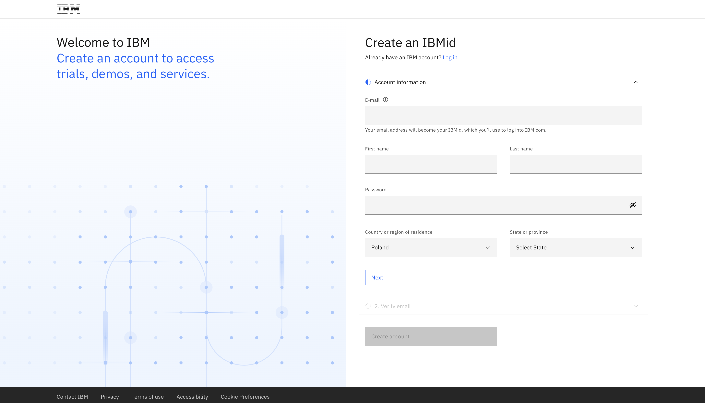

### IBMid
The first and primary requirement to participate in this laboratory is to have your own IBMid, which allows you to log into IBM Cloud. If you don't have an IBMid, you can obtain it by filling out the form available at the link below:

```
https://www.ibm.com/account/reg/us-en/signup?formid=urx-19776&target=https%3A%2F%2Flogin.ibm.com%2Foidc%2Fendpoint%2Fdefault%2Fauthorize%3FqsId%3Db9977aed-1e6b-4321-9b43-ee4365544452%26client_id%3DODllMDk4YzItMjgxOC00&_gl=1*1nosucy*_ga*MTc5MjI1NTMxNS4xNjg5MDcxNjU0*_ga_FYECCCS21D*MTY5Mjc5NTYxOS43NS4xLjE2OTI3OTYxNTQuMC4wLjA
```

To do this, fill in the necessary details in the form and then enter the verification number that will come to your email address.




### Next steps
If you are a workshop participant, provide your email address to the instructor and go to the [Join IBM Cloud](./join_ibm_cloud.md) section.

If you are an IBM employee, go to the [Access the environment](./reserve_environment_from_techzone.md) section.
