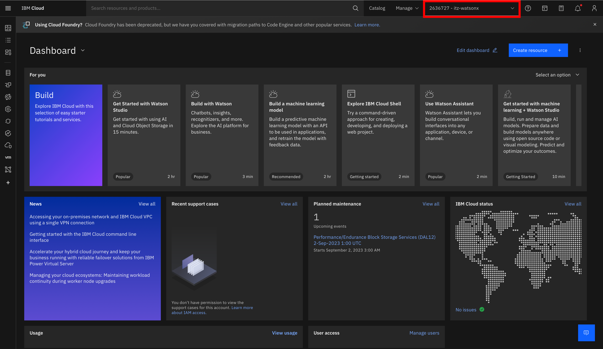

### Join IBM Cloud
If you are the owner of the watsonx.ai SaaS environment or it has been shared with you, you should expect two messages in your mailbox. One of the messages comes from IBM Technology Zone and the other from IBM Cloud. In this case, we are particularly interested in the second one - from IBM Cloud.


Upon clicking "Join now", you will be redirected to a form where you need to check the checkbox located at the bottom.


The result of this action should be a view from the IBM Cloud level with an active account


```
itz-watsonx
```



# Next Step

Proceed to the next step to [generate credentials](./prepare_apikey_and_projectid.md)
