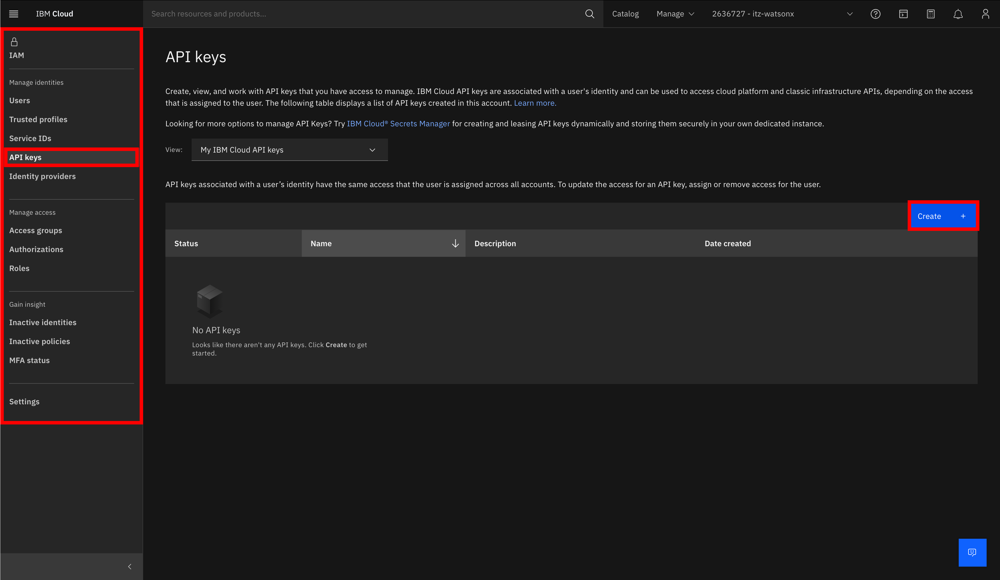
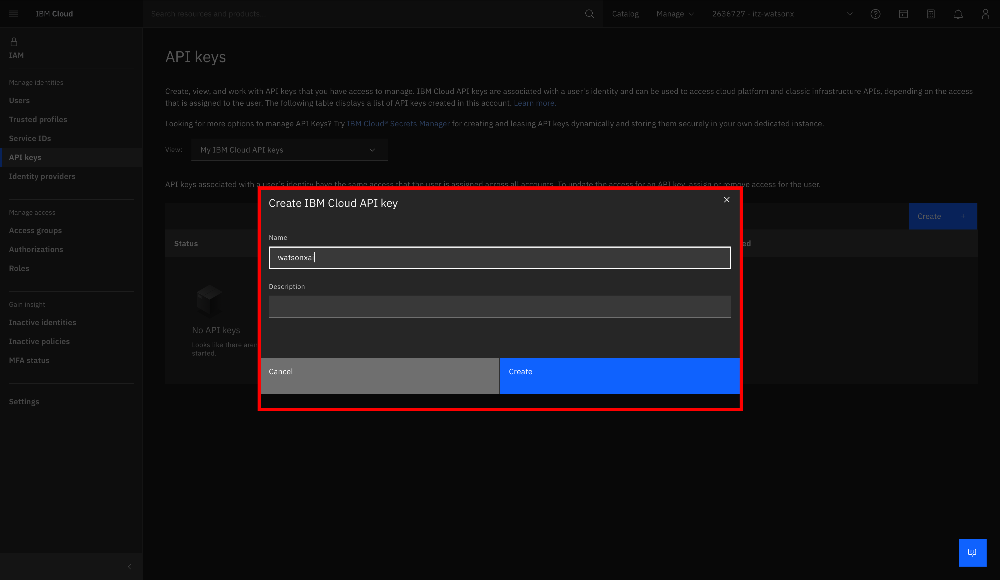
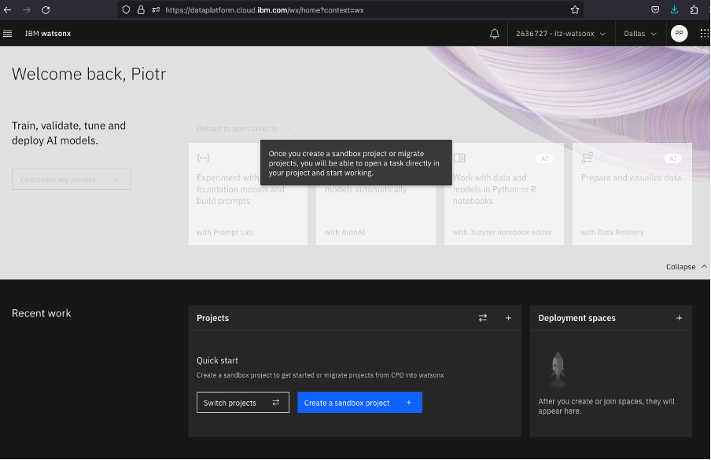
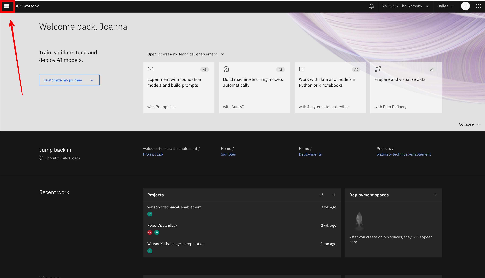
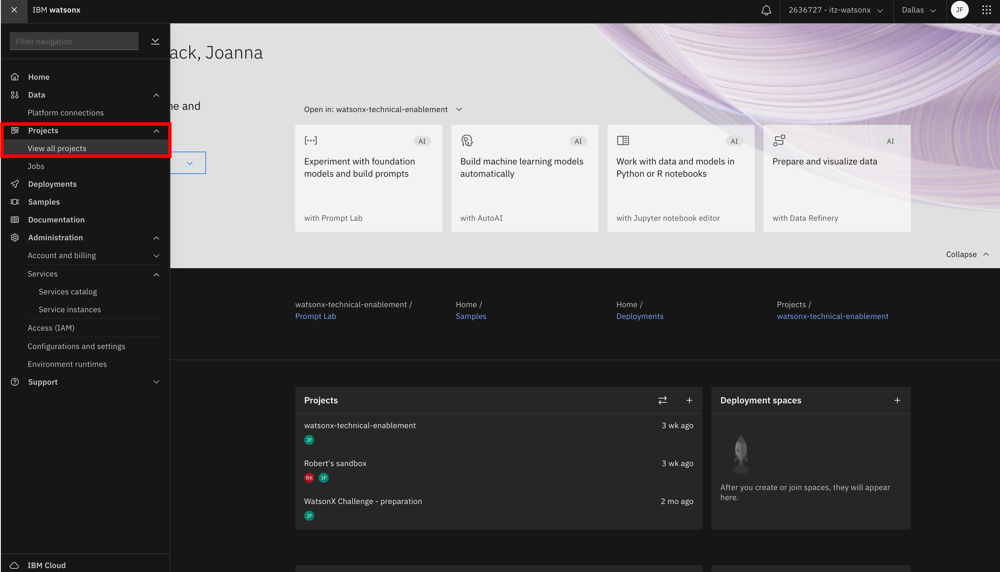
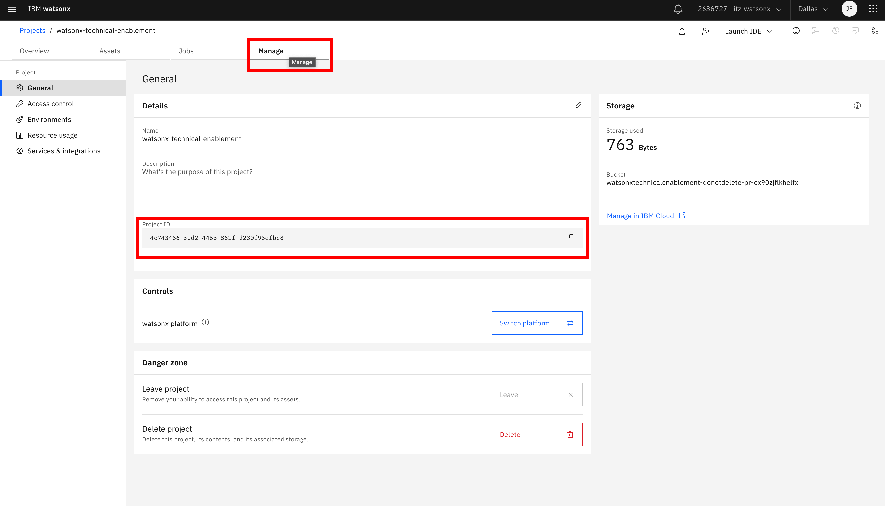

### Generate your api_key

To generate your api_key, follow the steps listed below:

1. Log in to your account (itz-watsonx) on IBM Cloud, and then go to the Manage tab:


2. After expanding the Manage tab, select the Access (IAM) option located in the Security and access section:


3. Once in Access (IAM), look on the left side for the API Keys tab, and then click on "Create" to create a new API key for today's labs.



4. In the next step, name your key - in my case, it's watsonxai - and click Create.



5. Then copy the newly created key and save it in your chosen location. We will use it in the last part of the lab.


### Generate project_id

To generate your project_id, follow the steps listed below:

1. Go to the watsonx.ai SaaS environment located at the link below:

```
https://dataplatform.cloud.ibm.com/wx/home?context=wx
```

Log in to the region:
```
Dallas
```

And then make sure you are logged into the account:
```
itz-watsonx
```


2. Create a new project.
In many cases, the project should be created automatically and be named "Your name's project". If the project did not create itself automatically, click on the blue button labeled "Create new sandbox project".



3. Enter the main menu, located in the top left corner of the screen:



4. Choose the Projects tab from the list, and in it, "View all projects".



5. Click on the name of your project and head to the Manage tab, where the project_id is located.



6. Then copy the project_id and save it in your chosen location. We will use it in the last part of the lab.

# Next step

In the next step, proceed to set up a [virtual environment for Python](./prepare_venv_for_python.md).