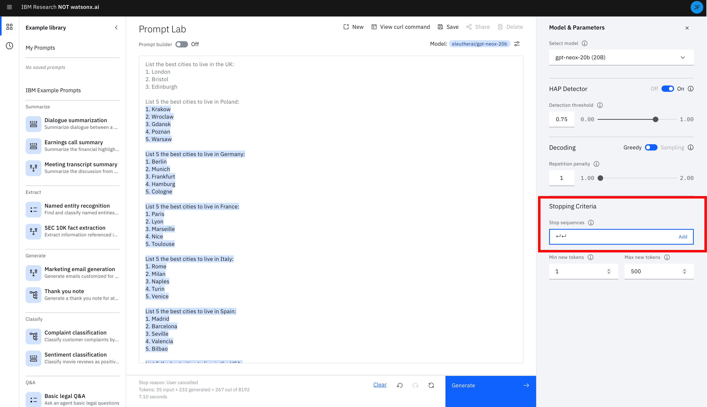

# Basics of Prompt Engineering

Welcome to the first part of the laboratory dedicated to the watsonx.ai platform.

In this part, we will get acquainted with the basic concepts related to large language models, familiarize ourselves with the structure of the project in watsonx.ai, and also learn about prompt engineering methods.

### Note
If you haven't set up your environment before starting the lab, do it [here](/LABS/0_environment_preparation/README.md).

In today's lab, we will use Prompt Lab, which is the first service labeled - "Experiment with foundational models and build prompts with Prompt Lab."


**Note:** The images below show actual results from watsonx.ai. The slightly gray text is the prompt. The text highlighted in blue is the model's response.

## 1.0 Basics of Large Language Models (LLMs)
Before we start exploring the capabilities of watsonx.ai, we first need to understand how large language models (LLMs) work and how we can fine-tune the model and its parameters to influence the final result.


Upon opening watsonx.ai, you should see the above view. The large central text area is the Prompt Lab, which is nothing more than our workspace. On the right side are sections that allow you to change the parameters of the selected model. Changing parameters affects the content generated by the model. Meanwhile, in the bottom left corner, after making a query to the Prompt Lab, a summary of the number of tokens used to generate the model's response appears.

## 1.1 Tokens

Each time you provide a prompt, the number of your "input tokens" and "output tokens" will be updated. Tokens are an important concept to understand because it is tokens that limit the performance of the model, and moreover, the cost of each query depends on them. One of the important conclusions you will be able to draw from the lab is that tokens do not correspond to words in natural language on a 1:1 basis. One token corresponds to an average of 4 characters, with characters being not only letters but also commas, dots, and spaces. Before sending each prompt to the model, the prompt is tokenized or divided into smaller subsets of characters, as text in this form is definitely more understandable for a large language model.

Depending on their specifics, models allow for processing a maximum of 2048 or 4096 tokens. Because the number of input tokens and output tokens adds up, the more detailed the prompt, the fewer resources for the model's response.

## 1.2 It's All in the Prompt

One of the most important things we want to convey during the lab is that watsonx.ai is not a chatbot interface. Therefore, just specifying instructions or questions rarely gives a good result. For example, what if we ask watsonx.ai for:


```
What are the best tourist attraction in Poland?
```


<p> </p>

## 1.3 Hint at the Expected Output Structure

From the above example, it is clear that simple input texts do not work for smaller LLMs. To get a structured response, attach a hint starting the answer in the desired structure. For example, just adding these two characters "-" radically improves the response.


<p> </p>

## 1.4 Prepare the Schema of Your Answer (Single Shot Prompting)

To get a higher quality answer, give an example of the desired answer. From a technical point of view, this is called Single Shot Prompting.


As you can see, giving one example before generating the expected answer using LLM is called Single Shot Prompting. Adding a larger number of examples is also common practice and is referred to as Few Shot Prompting. It is a powerful tool to ensure a specific result.

Copy, paste, and start your own experiment:

```
List the best cities to live in the UK:
1. London
2. Bristol
3. Edinburgh

List the best cities to live in Poland:
```


## 1.5 Include Details

The more hints you give, the better.

Selected hints:
- Text length,
- Text content,
- Text style


# Model Parameters

## 2.0 Adjust Your Model's Behavior
The first change we can make is the type of model (LLM) to be used to recognize and generate a response to the prompt we provide. This is the most important type of change that can be made, as individual models are better suited to specific types of tasks. Exercises in the later part of this lab will force you to change the model you use if you want to answer some of the more difficult questions.

In general, some models are better at summarizing, keywords, and semantics, while other models are better at structural text, such as HTML or JSON. The best way to find out which models apply to your use case is to simply test them, but it's important to know that model choice can make a big difference!

watsonx.ai also provides many parameters to configure how the LLM responds to the prompt. Choosing the right parameters can often be more of an art than a science. Investing time in understanding and then improving these parameters will be rewarded with better results.

Try the parameters with the given example:

```
List the best cities to live in the UK:
1. London
2. Bristol
3. Edinburgh

List the best cities to live in Poland:

```

## 2.1 Set the Minimum and Maximum Number of Tokens

If you think the generated text is too short or too long, try adjusting the parameters controlling the number of new tokens:

- The **Min new tokens** parameter controls the minimum number of tokens (~words) in the generated response
- The **Max new tokens** parameter controls the maximum number of tokens (~words) in the generated response


## 2.2 Define Stop Sequences

If you define stop sequences, the output will automatically stop when one of the stop sequences appears in the generated output.

**Example**

The output data in the image below generated two answers:


The image below specifies a stop sequence of two enter buttons:



The image below shows the effect of the stop sequence. The output data stops after two enter buttons:


## 2.3 Adjust Decoding Parameters

If the answer is too general or, conversely, is not creative enough, consider adjusting the decoding parameters.

**Decoding** is the process of finding an output sequence given an input sequence:

- **Greedy decoding** selects the word with the highest probability at each stage of the decoding process.
- **Sampling decoding** selects words from a probability distribution at each step:
  - **Temperature** refers to selecting high or low probability words. Higher temperature values lead to greater variability.
  - **Top-p** refers to selecting the smallest set of words whose cumulative probability exceeds p.
  - **Top-k** refers to selecting the k words with the highest probability at each step. Higher values lead to greater variability.

The advantage of greedy decoding is that you will see repeatable results. This can be useful for testing.
Setting the temperature parameter to 0 in the sampling decoding method gives the same variance as greedy decoding.


## 2.4 Add a Penalty for Repetitions

Sometimes you will see repeating text:


Raising the temperature parameter can sometimes solve the problem.

However, if the text still repeats, even at a higher temperature, you can try adding a repetition penalty. The higher the penalty, the less likely the results will contain repeating text.


# Tips

## 3.1 Check Your Use Case

LLMs have huge potential, but they don't have logic, knowledge, or domain experience. Some use cases are better suited than others: LLMs excel in tasks that involve generating general text or common code patterns and transforming input data.

If your prompt includes all the tips and best practices discussed here, but none of the models give good results, consider whether your use case might be a case that LLMs simply can't handle well.

### 3.2 Learn More

Check out the [NLP Course from HuggingFace](https://huggingface.co/learn/nlp-course/chapter0/1?fw=pt)

# Next Step

Proceed to the next step to start [Lab 2](/LABS/2_prompt_engineering_advanced/README.md)