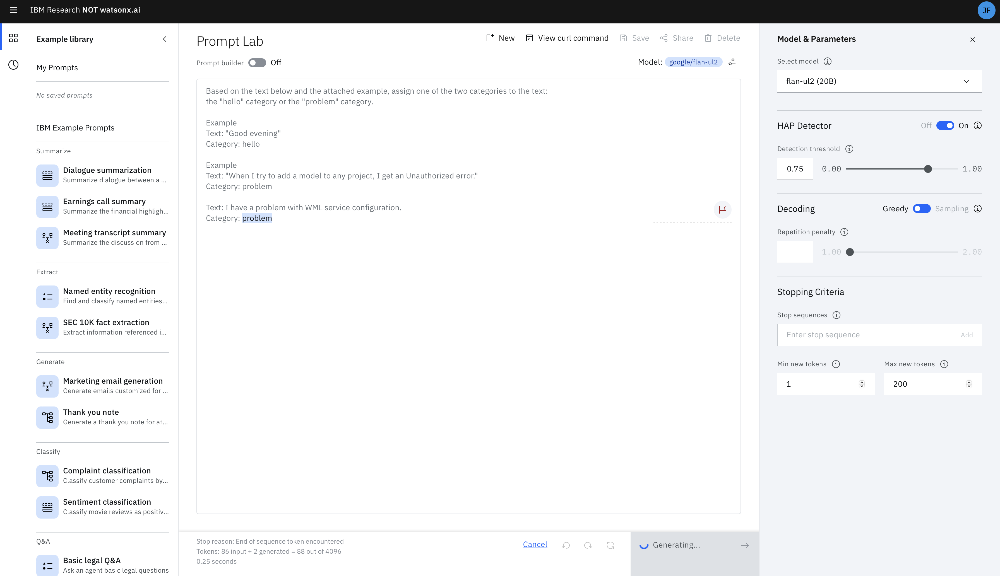
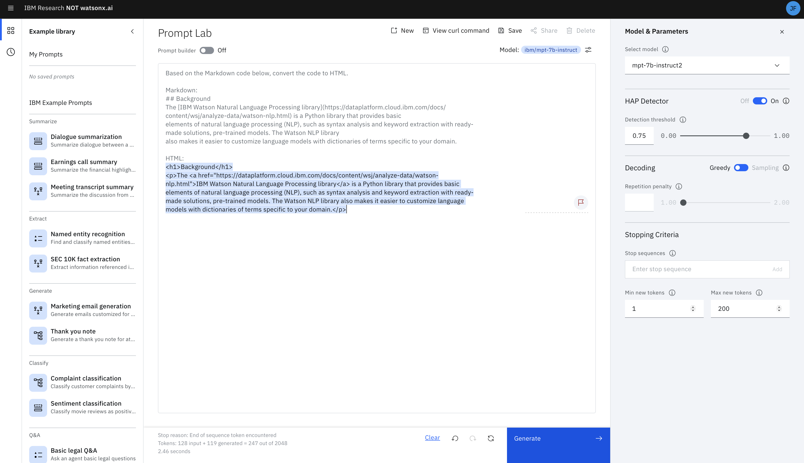
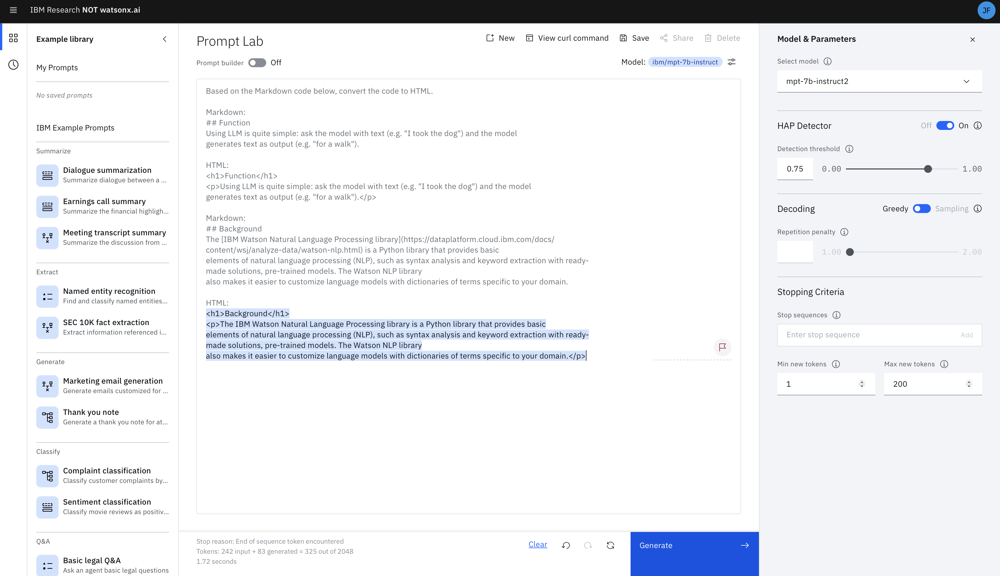
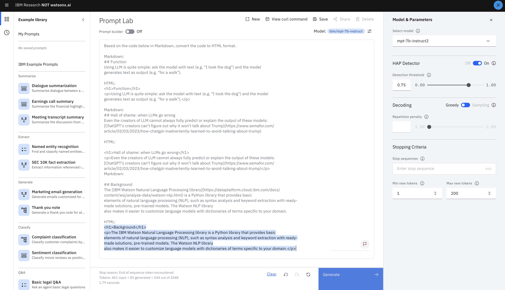
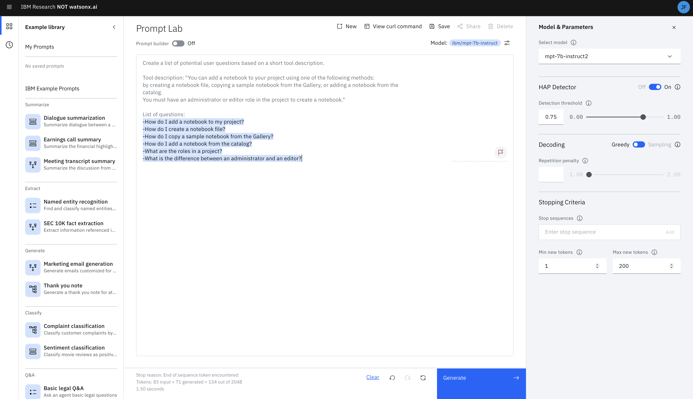
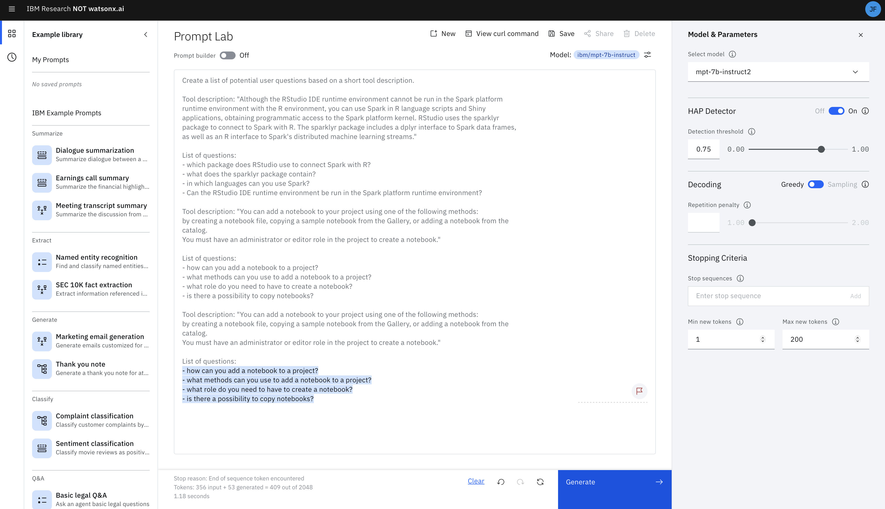
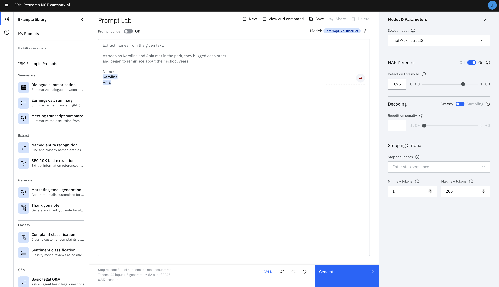
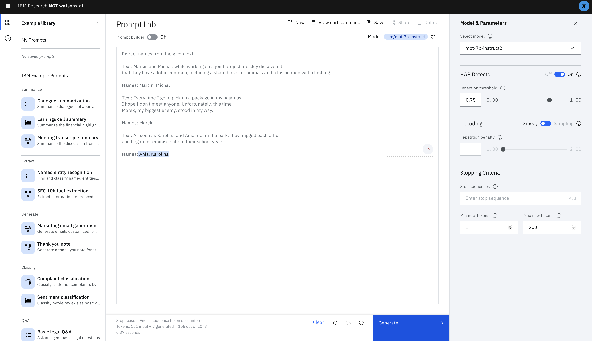
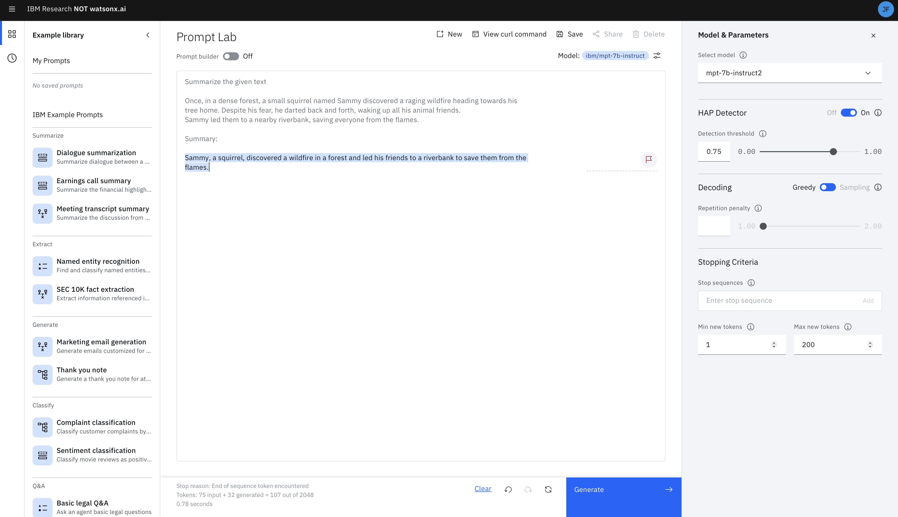
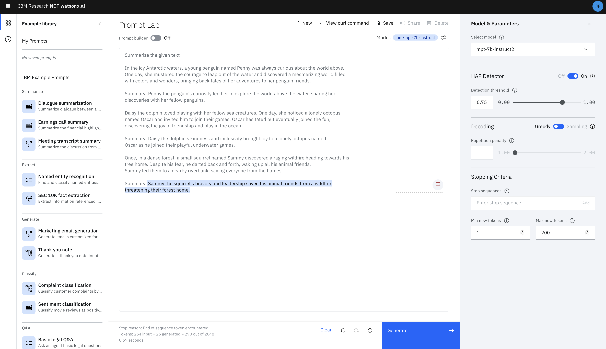

# Prompt engineering exercises

In this section, we will go through several practical examples of using large language models, utilizing the most common use cases such as classification, entity extraction, and question generation based on the given text.

### How to start working with the watsonx.ai tool?

Below are 5 exercises in which you will have the opportunity to test the capabilities of the watsonx.ai platform and the large language models available in it. However, before you start, let's get acquainted with how to build prompts.

A prompt is nothing more than input data that we pass to the model, giving it a task to perform. Each of the models may have different requirements for the structure of the created prompt. However, currently, having models available in watsonx.ai SaaS, the structure for each prompt should be similar.

### What is prompt engineering?
Prompt engineering is the process of creating, testing, and optimizing prompts, i.e., commands that guide artificial intelligence models to the correct answers or actions. Thus, to get the appropriate answer to our question, we need to train our model.

### What does model training look like?
Model training takes place through the prompting process, i.e., issuing commands to the model, consistent with the structure of the answer we expect.

We distinguish several types of prompting:
- **zero-shot prompting** - we don't give any example command
- **one-shot prompting** - we give one example command
- **few-shot prompting** - we give several example commands

Let's trace each type of prompting using the examples below.

# Exercises to be performed

Perform the following exercises using the Prompt Lab from watsonx.ai.

**Exercises**
<table>
<tr>
<td>1. Classification</a></td>
<td>Detect chatbot user intents</td>
</tr>
<tr>
<td>2. Programming transformations</a></td>
<td>Convert Markdown to HTML</td>
</tr>
<tr>
<td>3. Predicting questions</a></td>
<td>Predict potential customer questions</td>
</tr>
<tr>
<td>4. Text extraction</a></td>
<td>Extract names from a sentence</td>
</tr>
<tr>
<td>5. Summarization</a></td>
<td>Summarize given text</td>
</tr>
</table>

<p>&nbsp;</p>

## 1. Classification
**Objective** 
<table>
<tr>
<td>
Detect chatbot user intents
</td>
</tr>
</table>

In the given task, we expect our model to be able to classify chatbot user statements so that the chatbot can continue the conversation appropriately. Our task is to distinguish two classes:
- the "hello" class, which appears in the greeting,
- the "problem" class, which appears when the user reports difficulties with performing a task.

Our goal is to train our model in such a way that it can answer the following questions:

```
Hello, is anyone there?
```
```
I have a problem with WML service configuration.
```
```
Hello team, how can I import data into the project?
```

And our input data are sample user messages assigned to each class.
Class: "hello"
```
Hello
Hey
Good evening
Good morning
hello good morning
```

Class: "problem"
```
- Hello, I can't log in today because of this error. The owner's account is inactive.
- This may be due to the expiration of membership.
- I can't register my account, please help
- Hello, I received a message that Object-Storage preparation failed.
- Could you give me a suggestion? Thank you.
- Hello, I'm trying to request a new API access key, but I don't know what my identifier should be
- When I try to add a model to any project, I get an Unauthorized error.
```
Having such a structure prepared, we can consider four cases of prompt creation.

- **zero-shot prompting**
```
Based on the text below, assign one of the two categories to the text: 
the "hello" category or the "problem" category.

Text: I have a problem with WML service configuration.
Category:  

```
- **one-shot prompting**
```
Based on the text below and the attached example, assign one of the two categories to the text:
the "hello" category or the "problem" category.

Example
Text: "Good evening"
Category: hello

Text: I have a problem with WML service configuration.
Category:

```
- **two-shot prompting** (example of few-shot prompting)
```
Based on the text below and the attached example, assign one of the two categories to the text:
the "hello" category or the "problem" category.

Example
Text: "Good evening"
Category: hello

Example
Text: "When I try to add a model to any project, I get an Unauthorized error."
Category: problem

Text: I have a problem with WML service configuration.
Category:

```

- **three-shot prompting** (example of few-shot prompting)
```
Based on the text below and the attached example, assign one of the two categories to the text: 
the "hello" category or the "problem" category.

Example
Text: "Good evening"
Category: hello

Example
Text: "When I try to add a model to any project, I get an Unauthorized error."
Category: problem

Example
Text: "Hey"
Category: hello

Text: I have a problem with WML service configuration.
Category: 
```

Let's check the results of the given prompts in watsonx.ai.

- **zero-shot prompting**
Without providing any training example, the model could classify given text as a problem.


- **one-shot prompting**
By increasing the amount of sample data within few-shot prompting, we make sure that in the case of a more complicated example, our model will know exactly how to behave.


- **few-shot prompting** 



<p>&nbsp;</p>

## 2. Write from scratch
**Goal** 
<table>
<tr>
<td>
Convert Markdown to HTML
</td>
</tr>
</table>

The second, very commonly used use case for large language models is programming transformations, which significantly speed up developers' work. In the example below, we will convert code from Markdown to HTML.

Below are examples of code in Markdown format.

**Markdown**

```
## Background
The [IBM Watson Natural Language Processing library](https://dataplatform.cloud.ibm.com/docs/
content/wsj/analyze-data/watson-nlp.html) is a Python library that provides basic 
elements of natural language processing (NLP), such as syntax analysis and keyword extraction with 
ready-made solutions, pre-trained models. The Watson NLP library also makes it easier to 
customize language models with dictionaries of terms specific to your domain.
```
```
## Function
Using LLM is quite simple: ask the model with text (e.g. "I took the dog") and the model
generates text as output (e.g. "for a walk").
```
```
## Hall of shame: when LLMs go wrong
Even the creators of LLM cannot always fully predict or explain the output of these models:
[ChatGPT's creators can’t figure out why it won’t talk about Trump](https://www.semafor.com/
article/02/03/2023/how-chatgpt-inadvertently-learned-to-avoid-talking-about-trump)
```

Let's go through the prompting process again, highlighting examples of zero-shot prompting, one-shot prompting and few-shot prompting.

- **zero-shot prompting**
```
Based on the Markdown code below, convert the code to HTML.

Markdown:
## Background
The [IBM Watson Natural Language Processing library](https://dataplatform.cloud.ibm.com/docs/
content/wsj/analyze-data/watson-nlp.html) is a Python library that provides basic
elements of natural language processing (NLP), such as syntax analysis and keyword extraction 
with ready-made solutions, pre-trained models. The Watson NLP library
also makes it easier to customize language models with dictionaries of terms specific to your domain.

HTML: 

```

- **one-shot prompting**
```
Based on the Markdown code below, convert the code to HTML.

Markdown:
## Function
Using LLM is quite simple: ask the model with text (e.g. "I took the dog") and the model
generates text as output (e.g. "for a walk").

HTML:
<h1>Function</h1>
<p>Using LLM is quite simple: ask the model with text (e.g. "I took the dog") and the model
generates text as output (e.g. "for a walk").</p>

Markdown:
## Background
The [IBM Watson Natural Language Processing library](https://dataplatform.cloud.ibm.com/docs/
content/wsj/analyze-data/watson-nlp.html) is a Python library that provides basic
elements of natural language processing (NLP), such as syntax analysis and keyword extraction
with ready-made solutions, pre-trained models. The Watson NLP library
also makes it easier to customize language models with dictionaries of terms specific to your domain.

HTML: 

```

- **two-shot prompting**
```
Based on the code below in Markdown, convert the code to HTML format.

Markdown:
## Function
Using LLM is quite simple: ask the model with text (e.g. "I took the dog") and the model
generates text as output (e.g. "for a walk").

HTML:
<h1>Function</h1>
<p>Using LLM is quite simple: ask the model with text (e.g. "I took the dog") and the model
generates text as output (e.g. "for a walk").</p>

Markdown:
## Hall of shame: when LLMs go wrong
Even the creators of LLM cannot always fully predict or explain the output of these models:
[ChatGPT's creators can’t figure out why it won’t talk about Trump](https://www.semafor.com/
article/02/03/2023/how-chatgpt-inadvertently-learned-to-avoid-talking-about-trump)

HTML:

<h1>Hall of shame: when LLMs go wrong</h1>
<p>Even the creators of LLM cannot always fully predict or explain the output of these models: 
[ChatGPT's creators can’t figure out why it won’t talk about Trump](https://www.semafor.com/
article/02/03/2023/how-chatgpt-inadvertently-learned-to-avoid-talking-about-trump)</p>
Markdown:

## Background
The [IBM Watson Natural Language Processing library](https://dataplatform.cloud.ibm.com/docs/
content/wsj/analyze-data/watson-nlp.html) is a Python library that provides basic
elements of natural language processing (NLP), such as syntax analysis and keyword extraction 
with ready-made solutions, pre-trained models. The Watson NLP library
also makes it easier to customize language models with dictionaries of terms specific to your domain.

HTML:

```

Let's check the results of the given prompts in watsonx.ai.

- **zero-shot prompting**
Without providing any training example, the mpt-7b-instruct2 model knows the HTML structure and responds in the correct format


We'll see what changes after adding training examples

The model works correctly, but based on the example we provided, it gets rid of the structure containing the link to the page. This means that the model has learned that it should only highlight the heading and text in HTML.

- **one-shot prompting**


- **few-shot prompting** 


<p>&nbsp;</p>

## 3. Predicting Questions
**Objective** 
<table>
<tr>
<td>
Create a list of questions the customer may have about one of the topical passages provided
</td>
</tr>
</table>

In this exercise, we will focus on generating potential user questions based on short descriptions of tools from the Data Science area.

**Descriptions of individual tools**

[Creating notebooks](https://dataplatform.cloud.ibm.com/docs/content/wsj/analyze-data/creating-notebooks.html)
```
You can add a notebook to your project using one of the following methods: 
by creating a notebook file, copying a sample notebook from the Gallery, or adding a notebook from the catalog.
You must have an administrator or editor role in the project to create a notebook.
```
[Spark w RStudio](https://dataplatform.cloud.ibm.com/docs/content/wsj/analyze-data/rstudio-spark.html)
```
Although the RStudio IDE runtime environment cannot be run in the Spark platform runtime environment 
with the R environment, you can use Spark in R language scripts and Shiny applications, obtaining programmatic
access to the Spark platform kernel. RStudio uses the sparklyr package to connect to Spark with R. The 
sparklyr package includes a dplyr interface to Spark data frames, as well as an R interface to Spark's 
distributed machine learning streams.
```
[Narzędzie AutoAI](https://dataplatform.cloud.ibm.com/docs/content/wsj/analyze-data/autoai-overview.html)
```
The graphical AutoAI tool in Watson Studio analyzes data and detects data transformations, algorithms, 
and parameter settings that work best for a predictive modeling problem. AutoAI displays the results as 
candidate modeling pipelines ranked on a leaderboard for selection.
```

Let's go through the prompting process, highlighting examples of zero-shot prompting, one-shot prompting, and few-shot prompting.

- **zero-shot prompting**
```
Create a list of potential user questions based on a short tool description.

Tool description: "You can add a notebook to your project using one of the following methods: 
by creating a notebook file, copying a sample notebook from the Gallery, or adding a notebook from the catalog.
You must have an administrator or editor role in the project to create a notebook."

List of questions:
```

- **one-shot prompting**
```
Create a list of potential user questions based on a short tool description.

Tool description: "Although the RStudio IDE runtime environment cannot be run in the Spark platform 
runtime environment with the R environment, you can use Spark in R language scripts and Shiny applications, 
obtaining programmatic access to the Spark platform kernel. RStudio uses the sparklyr package to connect to 
Spark with R. The sparklyr package includes a dplyr interface to Spark data frames, as well as an R 
interface to Spark's distributed machine learning streams."

List of questions:
- which package does RStudio use to connect Spark with R?
- what does the sparklyr package contain?
- in which languages can you use Spark?
- Can the RStudio IDE runtime environment be run in the Spark platform runtime environment?

Tool description: "You can add a notebook to your project using one of the following methods: 
by creating a notebook file, copying a sample notebook from the Gallery, or adding a notebook from the catalog.
You must have an administrator or editor role in the project to create a notebook."

List of questions:
```

- **two-shot prompting**
```
Create a list of potential user questions based on a short tool description.

Tool description: "Although the RStudio IDE runtime environment cannot be run in the Spark 
platform runtime environment with the R environment, you can use Spark in R language scripts 
and Shiny applications, obtaining programmatic access to the Spark platform kernel. RStudio 
uses the sparklyr package to connect to Spark with R. The sparklyr package includes a dplyr 
interface to Spark data frames, as well as an R interface to Spark's distributed machine learning streams."

List of questions:
- which package does RStudio use to connect Spark with R?
- what does the sparklyr package contain?
- in which languages can you use Spark?
- Can the RStudio IDE runtime environment be run in the Spark platform runtime environment?

Tool description: "You can add a notebook to your project using one of the following methods: 
by creating a notebook file, copying a sample notebook from the Gallery, or adding a notebook from the catalog.
You must have an administrator or editor role in the project to create a notebook."

List of questions:
- how can you add a notebook to a project?
- what methods can you use to add a notebook to a project?
- what role do you need to have to create a notebook?
- is there a possibility to copy notebooks?

Tool description: "You can add a notebook to your project using one of the following methods: 
by creating a notebook file, copying a sample notebook from the Gallery, or adding a notebook from the catalog.
You must have an administrator or editor role in the project to create a notebook."

List of questions:
```
Let's check the results of the given prompts in watsonx.ai.

- **zero-shot prompting**
Without providing any training example, the model can infer what its task is and generates questions on the given description.




- **few-shot prompting** 
Providing two examples led to the model asking more complex questions. Moreover, it gives only for questions, like in our example.



<p>&nbsp;</p>


## 4. Entity extraction
**Objective** 
<table>
<tr>
<td>
Extract names from one of these sentences
</td>
</tr>
</table>

In this task, we will deal with the topic of entity extraction. It is an incredibly useful functionality, especially when dealing with long, chaotic reports. Entity extraction is nothing more than extracting the most important information, such as first name, last name, date, place, and time. In this example, we will focus on extracting names from the given short texts.

**Examples**
```
As soon as Karolina and Ania met in the park, they hugged each other 
and began to reminisce about their school years.
```
```
Marcin and Michał, while working on a joint project, quickly discovered 
that they have a lot in common, including a shared love for animals and a fascination with climbing.
```
```
When I looked out the window, I saw that my old acquaintance 
Diana, had returned to her hometown after many years of absence.
```
```
Every time I go to pick up a package in my pajamas, 
I hope I don't meet anyone. Unfortunately, this time 
Marek, my biggest enemy, stood in my way.
```

Let's go through the prompting process, highlighting examples of zero-shot prompting, one-shot prompting, and few-shot prompting.

- **zero-shot prompting**
```
Extract names from the given text.

As soon as Karolina and Ania met in the park, they hugged each other 
and began to reminisce about their school years.

Names:
```

- **one-shot prompting**
```
Extract names from the given text.

Text: Marcin and Michał, while working on a joint project, quickly discovered 
that they have a lot in common, including a shared love for animals and a fascination with climbing.

Names: Marcin, Michał

Text: As soon as Karolina and Ania met in the park, they hugged each other 
and began to reminisce about their school years.

Names:
```

- **two-shot prompting**
```
Extract names from the given text.

Text: Marcin and Michał, while working on a joint project, quickly discovered 
that they have a lot in common, including a shared love for animals and a fascination with climbing.

Names: Marcin, Michał

Text: Every time I go to pick up a package in my pajamas, 
I hope I don't meet anyone. Unfortunately, this time 
Marek, my biggest enemy, stood in my way.

Names: Marek

Text: As soon as Karolina and Ania met in the park, they hugged each other 
and began to reminisce about their school years.

Names:
```

Let's check the results of the given prompts in watsonx.ai.

- **zero-shot prompting**
Without providing any training example, the model was able to list the names contained in the short text.



- **one-shot prompting**
One training example resulted in the result being presented as a single string, as opposed to the previous bullet points.


- **few-shot prompting**
An additional example did not affect the generated results.


In this case, we dealt with a very simple example in which we tried to indicate only names. The number of necessary training prompts may change if we try to get more information from the given text. We encourage you to try this example on more complex data from which you can extract much more relevant information.

<p>&nbsp;</p>

## 5. Summarization
**Objective** 
<table>
<tr>
<td>
Summarize given text
</td>
</tr>
</table>

Summarization is a very common use case for large language models. In the example below, we will summarize the given texts.

Below are sample texts.

```
Once, in a dense forest, a small squirrel named Sammy discovered a raging wildfire heading towards his 
tree home. Despite his fear, he darted back and forth, waking up all his animal friends. 
Sammy led them to a nearby riverbank, saving everyone from the flames.
```

```
In the icy Antarctic waters, a young penguin named Penny was always curious about the world above. 
One day, she mustered the courage to leap out of the water and discovered a mesmerizing world filled 
with colors and wonders, bringing back tales of her adventures to her penguin friends.
```

```
In the quiet woods, Oliver the owl was known for his wisdom. Animals from all around sought his advice. 
One day, a lost rabbit asked him for directions home. Oliver not only guided the rabbit back but also taught 
her how to navigate the forest. The rabbit soon became a skilled navigator herself.
```

```
Daisy the dolphin loved playing with her fellow sea creatures. One day, she noticed a lonely octopus
named Oscar and invited him to join their games. Oscar hesitated but eventually joined the fun, 
discovering the joy of friendship and play in the ocean.
```

Let's go through the prompting process, highlighting examples of zero-shot prompting, one-shot prompting, and few-shot prompting.

- **zero-shot prompting**
```
Summarize the given text

Once, in a dense forest, a small squirrel named Sammy discovered a raging wildfire heading towards his 
tree home. Despite his fear, he darted back and forth, waking up all his animal friends. 
Sammy led them to a nearby riverbank, saving everyone from the flames.

Summary:
```

- **one-shot prompting**
```
Summarize the given text

In the icy Antarctic waters, a young penguin named Penny was always curious about the world above. 
One day, she mustered the courage to leap out of the water and discovered a mesmerizing world filled 
with colors and wonders, bringing back tales of her adventures to her penguin friends.

Summary: Penny the penguin's curiosity led her to explore the world above the water, sharing her 
discoveries with her fellow penguins.

Once, in a dense forest, a small squirrel named Sammy discovered a raging wildfire heading towards his 
tree home. Despite his fear, he darted back and forth, waking up all his animal friends. 
Sammy led them to a nearby riverbank, saving everyone from the flames.

Summary:
```

- **few-shot prompting**
```
Summarize the given text

In the icy Antarctic waters, a young penguin named Penny was always curious about the world above. 
One day, she mustered the courage to leap out of the water and discovered a mesmerizing world filled 
with colors and wonders, bringing back tales of her adventures to her penguin friends.

Summary: Penny the penguin's curiosity led her to explore the world above the water, sharing her 
discoveries with her fellow penguins.

Daisy the dolphin loved playing with her fellow sea creatures. One day, she noticed a lonely octopus
named Oscar and invited him to join their games. Oscar hesitated but eventually joined the fun, 
discovering the joy of friendship and play in the ocean.

Summary: Daisy the dolphin's kindness and inclusivity brought joy to a lonely octopus named 
Oscar as he joined their playful underwater games.

Once, in a dense forest, a small squirrel named Sammy discovered a raging wildfire heading towards his 
tree home. Despite his fear, he darted back and forth, waking up all his animal friends. 
Sammy led them to a nearby riverbank, saving everyone from the flames.

Summary:
```

Let's check the results of the given prompts in watsonx.ai.

- **zero-shot prompting**


- **one-shot prompting**


- **few-shot prompting**




<p>&nbsp;</p>

In all of the given cases, the model coped very well with summarizing the given text. Test the summarization using other models and see which one performs best.


# Next Step
Proceed to the next step to start [Lab 3](/LABS/3_prompt_engineering_via_code/README.md)