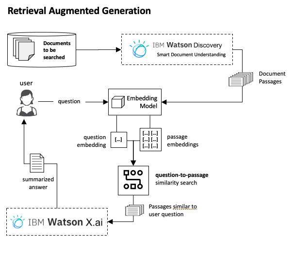

# Lab 5

## Introduction
In this lab, you will apply Retrieval Augment Generation (RAG) to retrieve then answer question based on knowledge base. Here is a high level view of a RAG implementation.

## Get Started

Implementation of the laboratory requires preparation of its environment.
- having your api key and project id (if you haven't generated api_key and project_id before starting the lab, do it [here](/LABS/0_environment_preparation/prepare_apikey_and_projectid.md))

To start the lab, download jupyter notebook located [here](/LABS/5_watsonx_rag)

