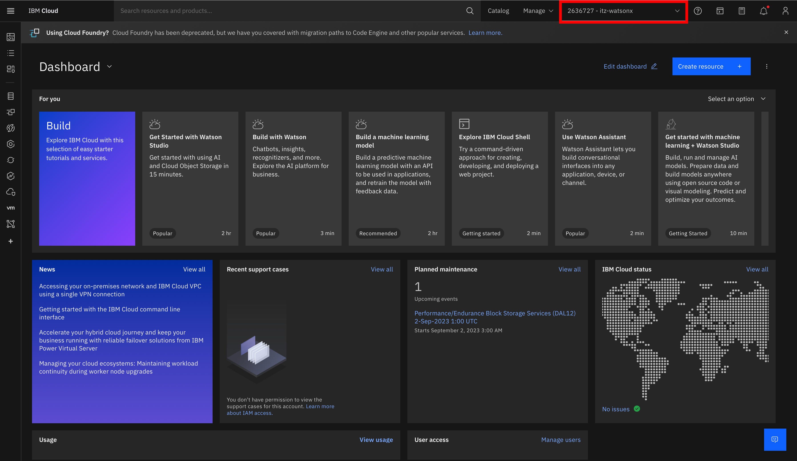
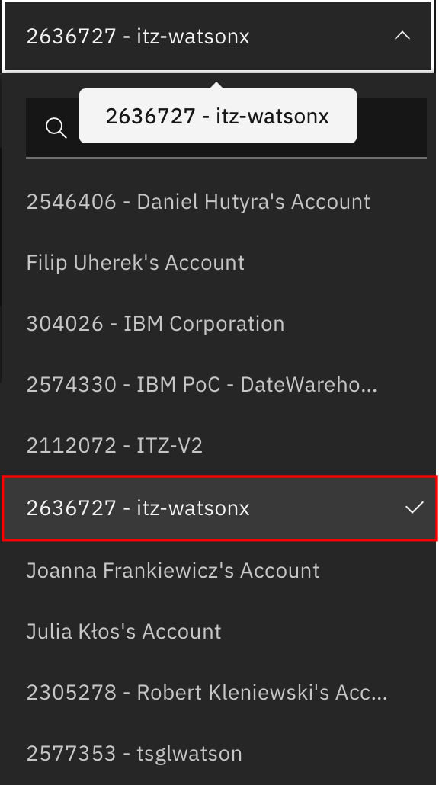

# Lab 0 : Przygotowanie środowiska watsonx.ai SaaS

### Środowisko watsonx.ai
W celu uzyskania dostępu do środowiska, w pierwszej kolejności należy uzyskać dostęp do środowiska watsonx.ai SaaS.
Dostęp można uzyskać poprzez rezerwację od prowadząego szkolenie lub rezerwując środowisko watsonx.ai SaaS bezpośrednio z [Techzone](https://techzone.ibm.com/collection/tech-zone-certified-base-images/journey-watsonx)

<p align="center">
  
</p>

<p align="center">
  
</p>

### Zaproszenie do dołączenia do IBM Cloud
Po niedługim czasie po uzyskaniu dostępu do środowiska na TechZone, na Twojej skrzynce powinien pojawić się mail od IBM Cloud o temacie: "Account: Action required: You are invited to join an account in IBM Cloud". 

<p align="center">
  
</p>


W celu uzyskania dostępu do konta, należy kliknąć w "Join now", które powinno przenieść nas do strony logowania, a następnie do formularza, w którym należy zaznaczyć checkbox z napisem "I accept the product Terms and Conditions of this registration form".

<p align="center">
  
</p>

Rezultatem tego działania powinien być następujący widok z poziomu (IBM Cloud)[https://cloud.ibm.com]

<p align="center">
  
</p>

Jeśli Twój widok z IBM Cloud wskazuje profil innego użytkownika, rozwiń listę dostępnych kont i poszukaj konta "itz-watsonx"

<p align="center">
  
</p>

Jeśli nie możesz znaleźć nazwy itz-watsonx na liście, przejdź proces dołączenia do konta itz-watsonx w IBM Cloud z wykorzystaniem przeglądarki w trybie prywatnym.

### Dostęp do konta itz-watsonx z poziomu watsonx.ai

Sprawdź czy posiadasz dostęp do środowiska po podanym adresem:

```
https://dataplatform.cloud.ibm.com/wx/home?context=wx
```
Przed rozpoczęciem laboratorium, upewnij się, że konto na które jesteś zalogowany nosi nazwę:

```
itz-watsonx
```


